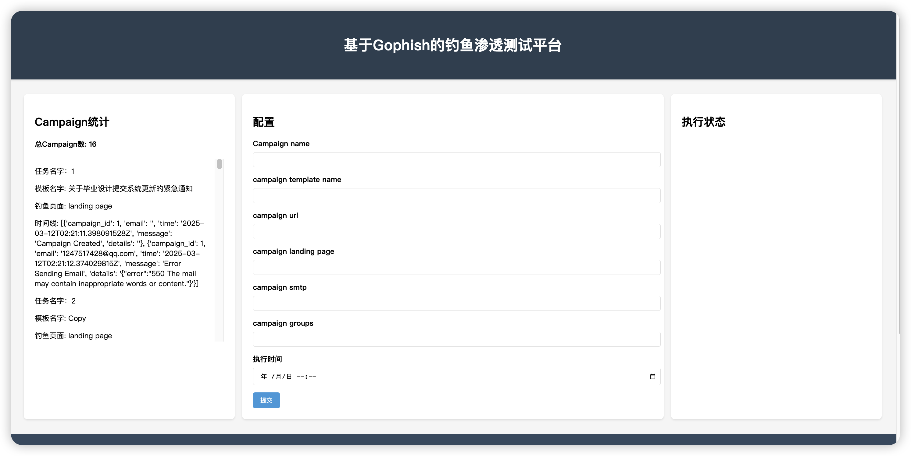
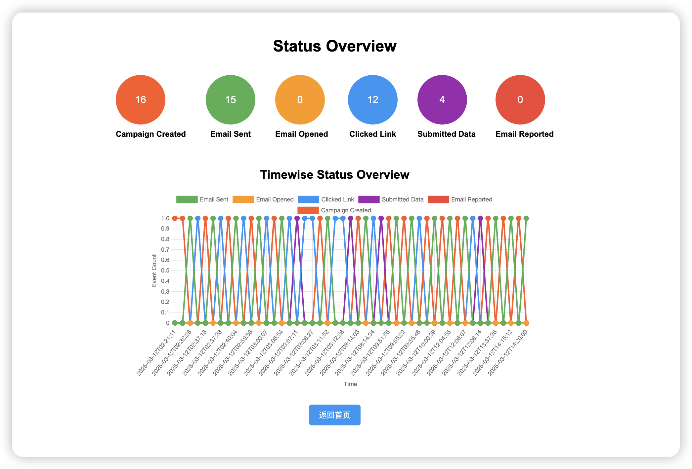

# gophish_2development
Secondary development function(毕业设计-基于Gophish的钓鱼渗透测试平台)
# 功能介绍-还在开发中ing
1. 新增了一个界面，配置campaign，定时执行；显示campaign的执行情况；显示campaign的统计数据；
2. 新增一个界面，查看所有数据的图表；
3. 新增了一个页面，生成结果报告；开发中ing

静态文件路径：static/图片name

# 效果图

